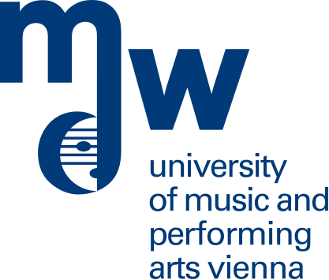
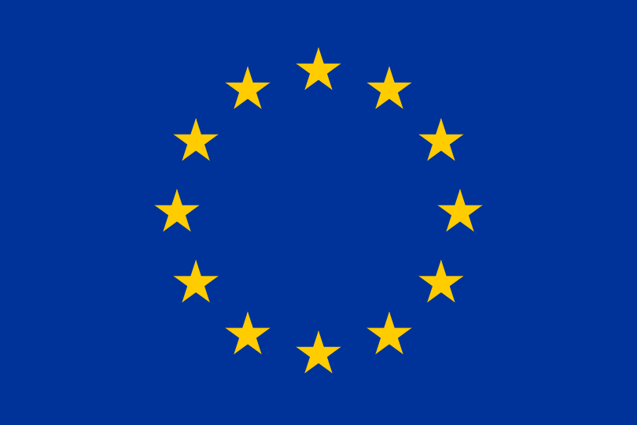
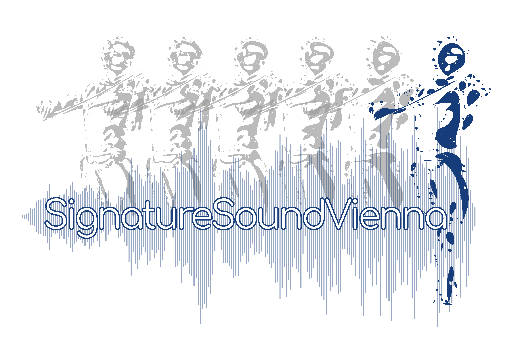
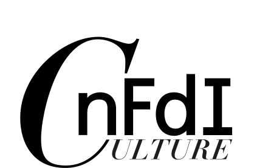
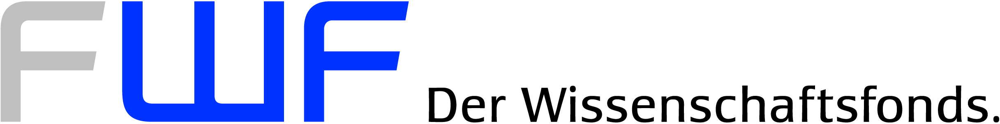

# About

The mei-friend Web application and its documentation have been designed and implemented by:

[Werner Goebl](https://iwk.mdw.ac.at/goebl/){:target="_blank"} ([@wergo](https://github.com/wergo)) & 
[David M. Weigl](https://iwk.mdw.ac.at/david-weigl/){:target="_blank"} ([@musicog](https://github.com/musicog)), 

[Department of Music Acoustics &ndash; Wiener Klangstil (IWK)](https://iwk.mdw.ac.at/){:target="_blank"}, 

[mdw &ndash; University of Music and Performing Arts Vienna](https://www.mdw.ac.at/){:target="_blank"}

    <ul class="logos">
        <li class="logo">
            
        </li>
        <li class="logo">
            
        </li>
    </ul>

## Funding

Development of mei-friend has been funded by several research projects over the years:

[H2020 TROMPA &ndash; Towards Richer Online Music Public-domain Archives 2018&ndash;2021](https://iwk.mdw.ac.at/h2020-trompa/){:target="_blank"}

[FWF Signature Sound Vienna 2021&ndash;2024](https://iwk.mdw.ac.at/signature-sound-vienna/){:target="_blank"}

[NFDI4Culture research tooling development grant 2023](https://nfdi4culture.de/){:target="_blank"}

[Weave / FWF E-LAUTE &ndash; Electronic Linked, Annotated, and Unified Tablature Edition 2023&ndash;2026](https://iwk.mdw.ac.at/e-laute/){:target="_blank"}

    <ul class="logos">
        <li class="logo">
            
        </li>
        <li class="logo wide">
            
        </li>
        <li class="logo wide tall">
            
        </li>
        <li class="logo">
            
        </li>
        <li class="logo">
            
        </li>
        <li class="logo wide">
            
        </li>
    </ul>

## Acknowledgments

We thank Anna Plaksin ([@annplaksin](https://github.com/annplaksin){:target="_blank"}) for her on-going contributions to mei-friend's development via an [NFDI4Culture 2023](https://nfdi4culture.de/){:target="_blank"} ) research tooling development grant: [Musicological mark-up with mei-friend](https://nfdi4culture.de/news-events/news/2nd-forum-further-development-of-research-tools-data-services-report.html){:target="_blank"}.

We thank Matthäus Pescoller ([@mapscl](https://github.com/mapscl){:target="_blank"}) for contributing to the documentation, and for his extensive testing of mei-friend in the creation of orchestral score encodings in the purvue of [Signature Sound Vienna](https://github.com/signature-sound-vienna){:target="_blank"}.

We thank the MEI community for input to the development of mei-friend. 
In particular, we would like to acknowledge Laurent Pugin ([@lpugin](https://github.com/lpugin){:target="_blank"}), who contributed the code for schema validation, and 
Thomas Weber ([@th-we](https://github.com/th-we){:target="_blank"}), who helped to improve the speed mode module.

## License

The mei-friend Web application is published under [GNU AGPL 3.0](https://github.com/mei-friend/mei-friend/blob/main/LICENSE){:target="_blank"}. 

The mei-friend documentation is provided under [CC BY 4.0](http://creativecommons.org/licenses/by/4.0/){:target="_blank"}.

## Components

The mei-friend Web application uses [CodeMirror](https://codemirror.net){:target="_blank"} as its text editor, and [Verovio](https://www.verovio.org){:target="_blank"} as its music engraving engine. [GitHub](https://github.org){:target="_blank"} integration is provided using [jsgit](https://github.com/creationix/jsgit){:target="_blank"}, [jsgit-browser](https://github.com/LivelyKernel/js-git-browser){:target="_blank"}, and the [GitHub REST API](https://docs.github.com/en/rest){:target="_blank"}. XML-DOM manipulations are performed using [tXml](https://github.com/TobiasNickel/tXml){:target="_blank"} by Tobias Nickel. The MEI validation and RNG loading code is adapted from the implementation in the [Verovio editor](https://editor.verovio.org){:target="_blank"}, kindly contributed by Laurent Pugin. It makes use of [libxml2](https://gitlab.gnome.org/GNOME/libxml2/){:target="_blank"}. PDF functionalities are provided by [PDFKit](https://github.com/foliojs/pdfkit) by Devon Govett, using [SVG-to-PDFKit](https://github.com/alafr/SVG-to-PDFKit). MIDI playback is implemented using [html-midi-player](https://github.com/cifkao/html-midi-player){:target="_blank"}. This is itself powered by [Magenta.js](https://github.com/magenta/magenta-js/tree/master/music/){:target="_blank"}, which also provides the [SGM_Plus sound font](https://storage.googleapis.com/magentadata/js/soundfonts/sgm_plus/soundfont.json){:target="_blank"} used to sonify your encoding. Icons are taken from GitHub's [Octicons repository](https://github.com/primer/octicons){:target="_blank"}.

The mei-friend documentation website adapts the [Docsy Jekyll template](https://vsoch.github.io/docsy-jekyll/){:target="_blank"}, which is based
on the beautiful [Docsy](https://github.com/google/docsy){:target="_blank"} template for [Hugo](https://gohugo.io/){:target="_blank"}. The mei-friend documentation website is hosted by [GitHub Pages](https://pages.github.com){:target="_blank"}.

## Publications

Goebl, W., & Weigl, D. M. (2024). mei-friend: An Interactive Web-based Editor for Digital Music Encodings. <em>Journal of Open Source Software</em>, 9(97), 6002. doi:[10.21105/joss.06002](https://doi.org/10.21105/joss.06002){:target="_blank"}

Goebl, W., & Weigl, D. M. (2023). mei-friend v1.0: Music Encoding in the Browser. <em>Encoding Cultures. Joint MEC and TEI Conference 2023<7em>, Paderborn, Germany. https://teimec2023.uni-paderborn.de/contributions/159.html

<a name="GoeblWeigl-MEC2022">Goebl, W. & Weigl, D. M. (2023). The mei-friend Web Application: Editing MEI in the Browser. <em>Music Encoding Conference 2022</em> [Late-breaking Reports].
doi:[10.17613/dnj6-yy29](https://doi.org/10.17613/dnj6-yy29){:target="_blank"}

Goebl, W. & Weigl, D. M. (2022). Alleviating the Last Mile of Encoding: The mei-friend Package for the Atom Text Editor.  In S. Münnich & D. Rizo (Eds.), <em>Music Encoding Conference Proceedings 2021</em> (pp. 31&ndash;39). University of Alicante. 
doi:[10.17613/fc1c-mx52](https://doi.org/10.17613/fc1c-mx52){:target="_blank"} **(Best Paper Award MEC'21)**

## Support

If you need help, please don't hesitate to [open an issue](https://www.github.com/{{ site.github_user }}/{{ site.github_repo }}){:target="_blank"}.

